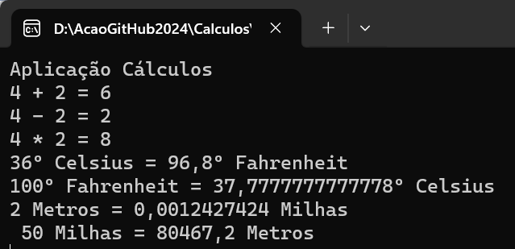

# Cálculos  :1234:
 Aplicação C# - para realizar diversos cálculos

 Desenvolvida no âmbito da ação de formação **Introdução ao Git e GitHub**
## Operações suportadas
Neste momento esta aplicação implementa as seguintes operações:
- Soma
- Subtração
- Conversão de temperatura
    - Celsius :arrow_right: Fahrenheit
    - Celsius :arrow_left: Fahrenheit
     Conversão de Distância
    - metros:arrow_right: milhas
    - metros:arrow_left: milhas
## Tecnologias utilizadas neste projeto
- Visual Studio
- C#
- Git
- GitHub Desktop
- Plataforma GitHub
##Site oficial
Faça download desta aplicação no site oficial: [www.calculos.com] (https://www.calculos.com)
